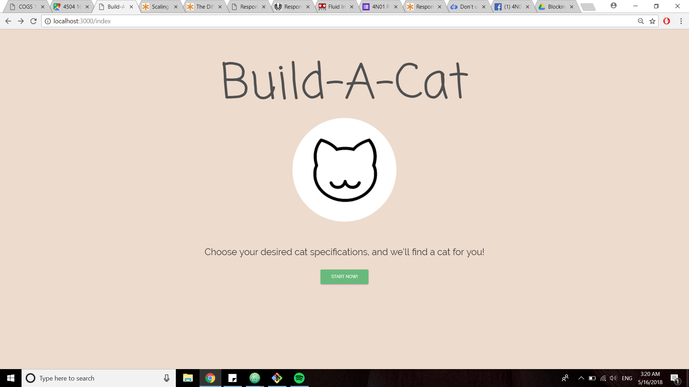
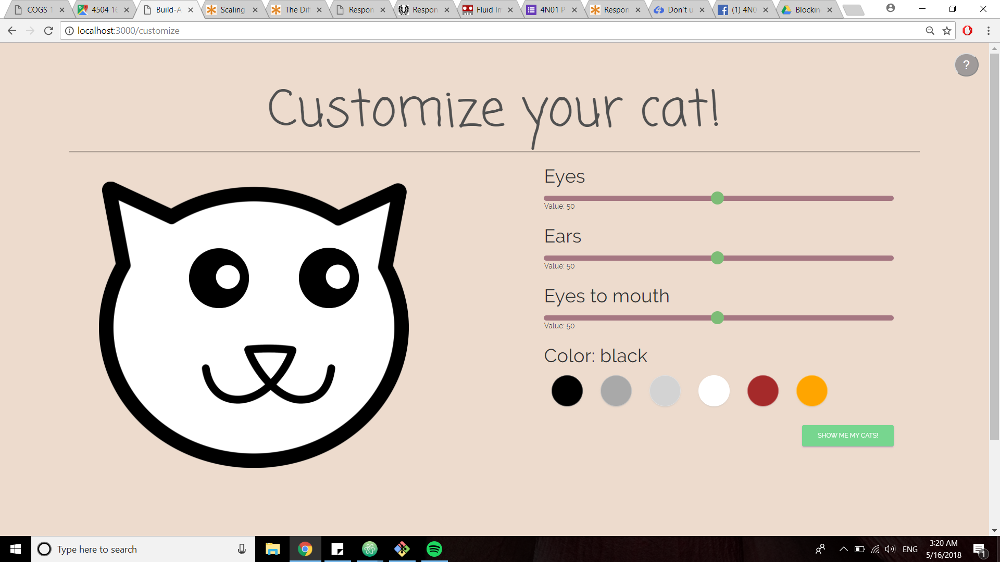
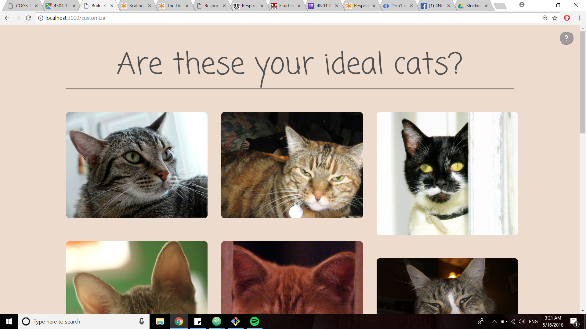
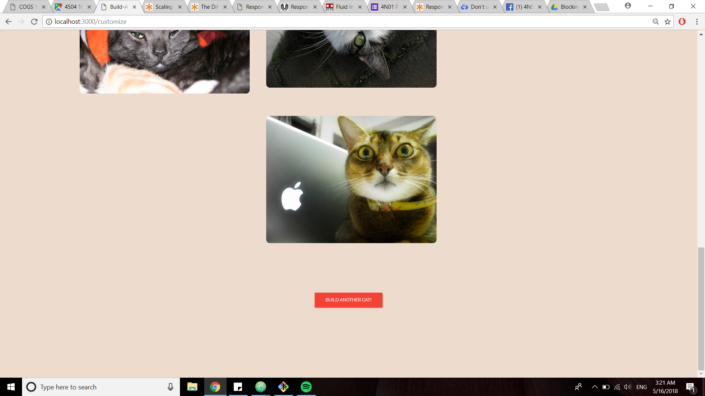

Milestone 5 Document

Team: .cat
Due: May 16, 2018

Hee Ro Chung
Kevin Jan
Sally Lai U
Kate Wong

UI Skeleton Webpages

Landing Page:

The only thing that has changed about this page is the background color, which is a brighter yet still mild color.
The color is more similar to cats, and is therefore more relatable to those using this application.

Cat Personalization Page:

Like the Landing page, we changed our background color to be more suitable to our application. We also changed the slider colors
to compliment our background color. Additionally, we included a line under the "Customize your cat!" to solidify the location
of the page title. Lastly, we replaced the "back" and "done" buttons with a "show me my cats!" button to create a more
light-hearted atmosphere, making the application more kid-friendly as well. A "back" was also not necessary as going back only
took the user back to the landing page.

In our latest version of Build-a-cat, we included an option for users to select a fur color they prefer for their ideal cat.
Because the customization page is already fairly simple, we displayed the color choices below the sliders rather than
creating a dropdown for the colors. This way, all stylistic options are immediately visible and the user does not have to
take extra steps/clicks to navigate through customizing options. Right above the array of colors we display the color the
user has chosen with "black" as the default color. The border of the cat image also changes according to the color the user
selects.

Results Page:

The format in which the resulting cat images are displayed has been changed to resemble the way Pinterest displays relevant
pins. This way, the user is able to scroll through the images without any awkward gaps from different sized cats pictures.
The images also have rounded corners, making the resulting gallery look less harsh, and more lovable. Lastly, we have a button
at the bottom of the results page that takes the user back to the customization page. Instead of "back" we labeled the button
"Build another cat!" This encourages users to not stop their search for their ideal cat, and also offers users an easy and
straightforward way to re-customize a cat's face.

Non-Trivial User Actions

(1) Sliders: Users use the sliders to manipulate the facial features of the cat, which are reflected on the cat's face
on the page in real time, creating a click and drag effect. Then based on the user's preferences, the results page displays
a variety of cat images that reflect the facial feature proportions and distances that the user input.

(2) Color picking: Users click on the color of the cat they want, which is reflected on the cat's image. Rather than the entire
cat's face color changing, just the border of the cat is changed when the user clicks on a new color. This is to keep a clean
design and to also keep the color from distracting the user from the cat's facial features.
