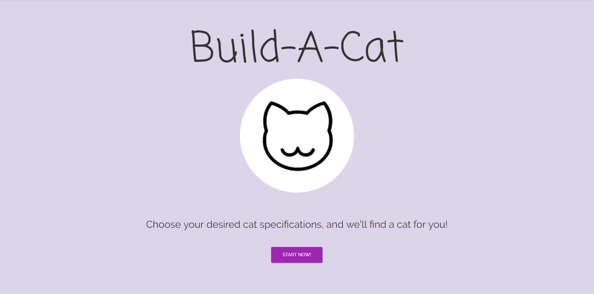
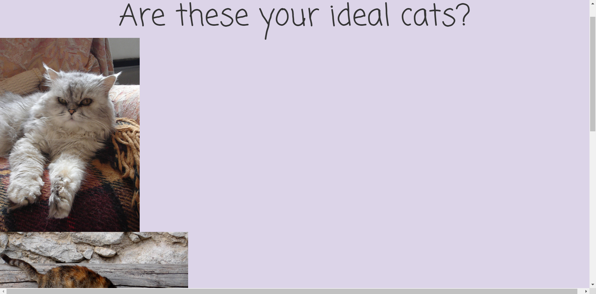

Milestone 2 Document
Team: .cat
Due: April 23, 2018

Hee Ro Chung
Kevin Jan
Sally Lai U
Kate Wong

UI Skeleton Webpages

Landing Page:

The landing page is nearly identical to our first paper prototype. The simple skeleton of the webpage includes the
app name at the top of the page, an image of a cat underneath the title, a description of what the app provides,
and a button that takes the user to the next page to begin customizing his or her cat. One difference is that the
skeleton does not contain a help button yet. However, other than that, the UI skeleton is made exactly the way we
had planned.

Cat Personalization Page:

The cat customization page is again very similar to our first paper prototype. Like the prototype, we have an image
of a cat on the left, and slider bars on the right that correspond to a cat's facial features that the user can use
to customize his or her ideal cat. However, while the prototype uses icons to label the slider bars, for now we have
labeled the slider bars using their respective words instead (i.e. Eyes). Additionally, the prototype simply states
"Features" at the top of the webpage, but to give the user more direction on what to do on this page, we tell the user
to "customize your cat!". Lastly, unlike the prototype, we have added a "back" button that brings the user back to
the landing page.

Cat Results Page:

The last page, or the results page is also very similar to the first paper prototype. The layout of the page is
the same as the resulting cat images are displayed like a gallery that the user can scroll through to see.
However, there is a difference in content between the paper prototype and the UI skeleton. The paper prototype
states "here are your cats" while the UI skeleton asks the user "are these your ideal cats?". Although the change
is minimal, the paper prototype's version notifies the users that it found results based on the user's input.
On the other hand, the UI skeleton asks if the user is satisfied with the results, and also offers to the user a way
to go back to the customization page or back to the home page, giving the user the option to not only
continue customizing a cat, but also start over again if desired.
